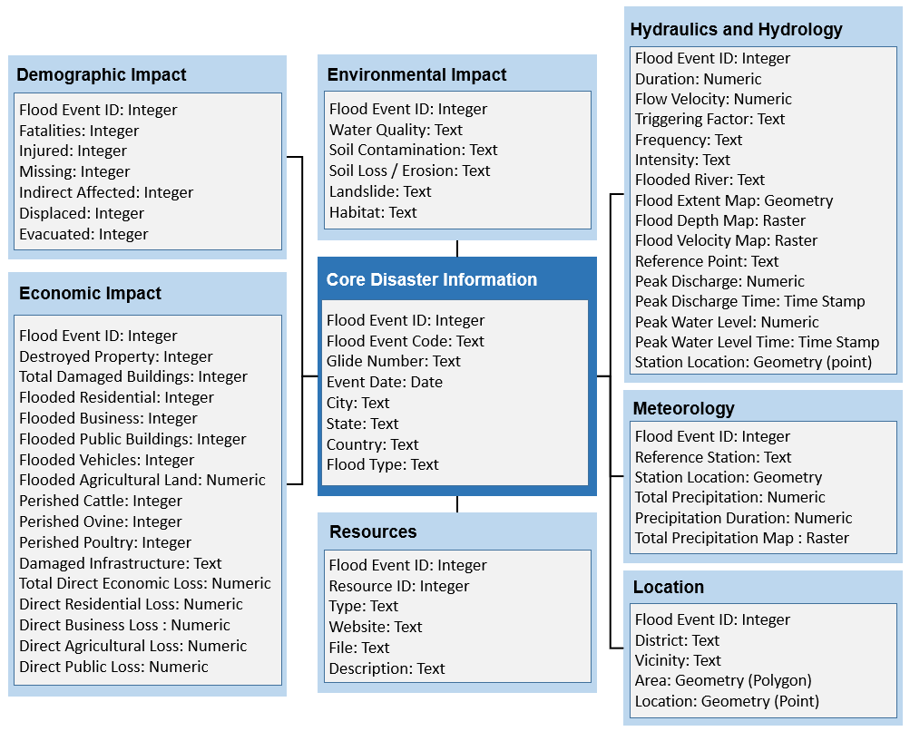

# Flood Event Data Specification (FEDS)

## Introduction

The purpose of the specification is standardizing the flood event data collection for both historic and future events. The specification is aimed to cover various aspects of a flooding event such as economic, demographic, hydralics, hydrologic, meteorologic, and environmental impact. So, an event inventory that uses this set of specification will be able to provide analysis for multiple stakeholders (i.e. planners, emergency responders). The specfication is illustrated in the figure below. It is also provided with multiple formats (xml, sql, json). 

This repository provides the flood data event specification that is presented in the following publication:

*Haltas, I., Yildirim, E., Oztas, F., Demir I. (2020) A Comprehensive Flood Event Data Specification and Inventory: 1930-2020 Turkey Case Study. TBD.*

 
 

# Turkey Flood Data Inventory (TFID)
In dataset folder, a comprehensive flood event inventory is shared for Turkey case study. The inventory was compiled for Turkey between 1930-2020 using existing national and global data sources and digitized media archives. A total of 2,101 flood events with 64 data attributes have been collected over the last 90 years. The dataset is available in CSV and XLS formats. 

## Citation
If you use the specification or flood event inventory please cite the following publication:

Haltas, I., Yildirim, E., Oztas, F., Demir I. (2020) A Comprehensive Flood Event Data Specification and Inventory: 1930-2020 Turkey Case Study. TBD.

## Feedback

Feedbacks are always welcomed to improve the specification.

Disclaimer: This specification is in constant expansion and development, and is subject to change.

## License

This project is licensed under the MIT License - see the [LICENSE](https://github.com/uihilab/Flood-Event-Data-Specification/blob/master/LICENSE) file for details.

## Acknowledgements

This project is developed by the University of Iowa Hydroinformatics Lab (UIHI Lab): 
https://hydroinformatics.uiowa.edu/.
